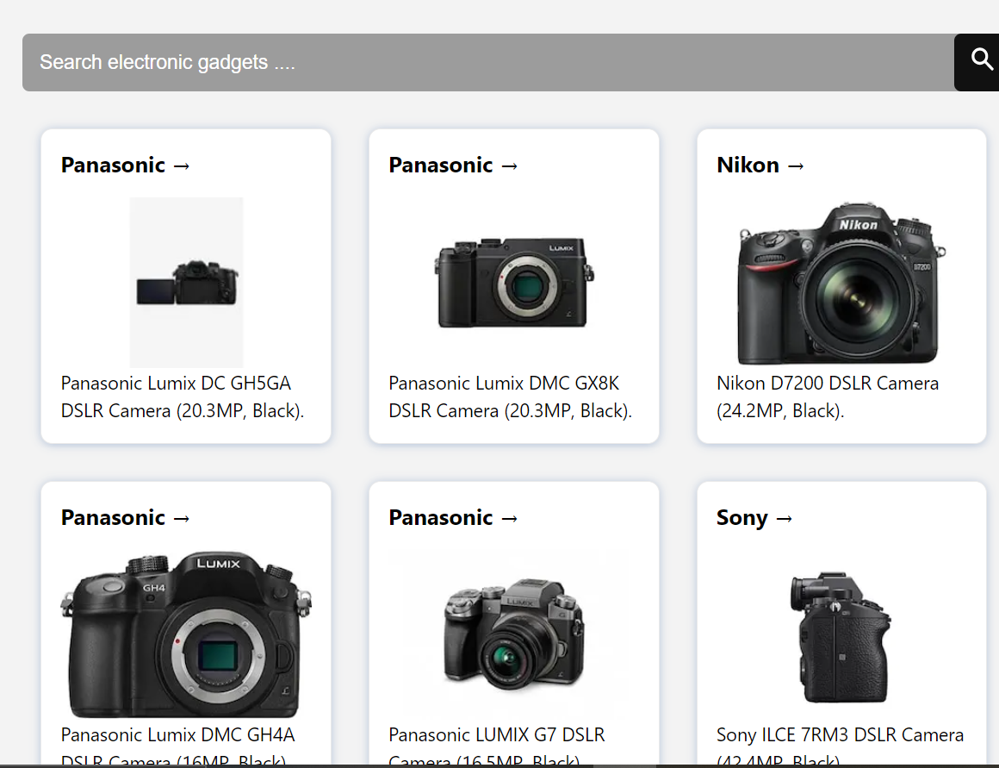

AI-Based Product Recommendation System  
<b>Team Name</b>: <i>Monad Army</i>  
Team Members: 
1)<b>HarshVardhan</b> 
2)<b>Trijal Sharma</b> 
3)<b>Aayush Garg</b> 

The AI-Based Product Recommendation System uses collaborative filtering and content-based algorithms to analyze user behavior and product attributes. By understanding user preferences and the characteristics of different products, the system generates recommendations that are tailored to individual users.

Project Demo:

**=> Product screen with product details and the recommended products of `different brands`**

**=> Product screen with product details and the recommended products of the `same brand`**

